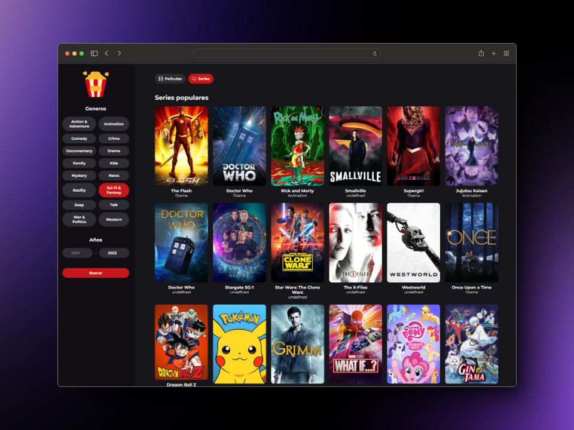

# Buscador de Películas y Series(TMDB)

Este proyecto es una simulación educativa de un buscador de películas y series utilizando la API de The Movie Database (TMDB). Permite a los usuarios explorar las películas y series más populares del momento, obtener detalles, y realizar búsquedas personalizadas por género y fecha de lanzamiento.



## Características Principales

### 1. Selección de Películas o Series
Los usuarios pueden elegir entre explorar las películas o series más populares en el momento.

### 2. Detalles en Card
Cada elemento muestra información clave como título, género e imagen de portada de la película o serie.

### 3. Modal de Detalles
Haciendo clic en una card, se abre un modal con detalles adicionales, incluyendo la descripción, una imagen de fondo y la portada de la película.

### 4. Paginación
Botones de 'anterior' y 'siguiente' permiten al usuario explorar más películas o series.

### 5. Filtro de Búsqueda
Los usuarios pueden buscar películas por género o fecha de lanzamiento, ofreciendo una experiencia personalizada.

## Tecnologías Utilizadas

- **HTML5:** Estructura y organización del contenido.
- **Sass:** Preprocesador CSS para mejorar la legibilidad y mantenimiento del código.
- **JavaScript:** Lógica del buscador, manejo de eventos y acciones del usuario.
- **Rollup:** Utilizado para compilar el código JavaScript.
- **API TMDB:** Se integra para la obtención de datos sobre películas y series.

## Estructura de Carpetas

- **css/:** Contiene los archivos CSS generados a partir de los estilos Sass.
- **img/:** Almacena las imágenes utilizadas.
- **index.html:** Página principal.
- **src/:** Contiene los archivos JavaScript que implementa toda la lógica del proyecto.

## Instrucciones de Ejecución

1. Para visitar la web, sigue este enlace: [Películas y Series(TMDB)](https://horaciomartinez17.github.io/buscador-peliculas-series-TMDB/)

2. Clona este repositorio en tu máquina local.

    ```bash
    git clone [URL_DEL_REPOSITORIO]
    ```

3. Abre el archivo `index.html` en tu navegador preferido.

4. Explora las películas y series, utiliza la barra de búsqueda y disfruta de la experiencia.


## Contribuciones

¡Contribuciones son bienvenidas! Siéntete libre de mejorar este proyecto y enviar tus contribuciones.
